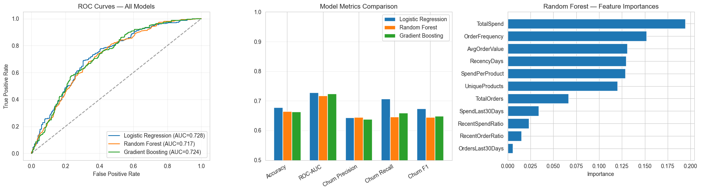
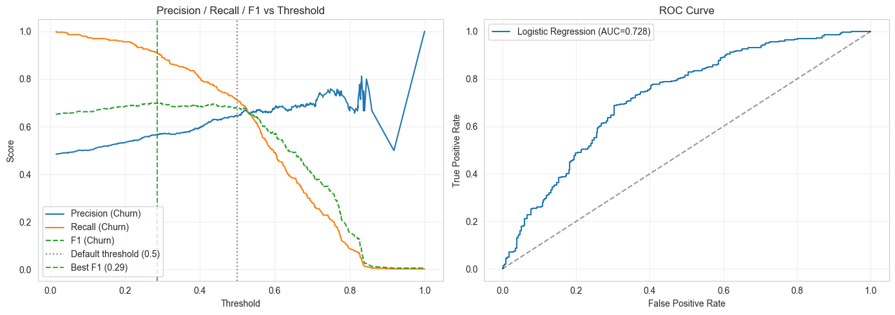
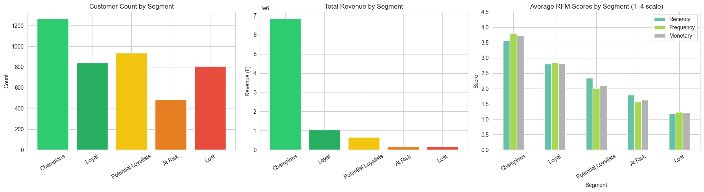
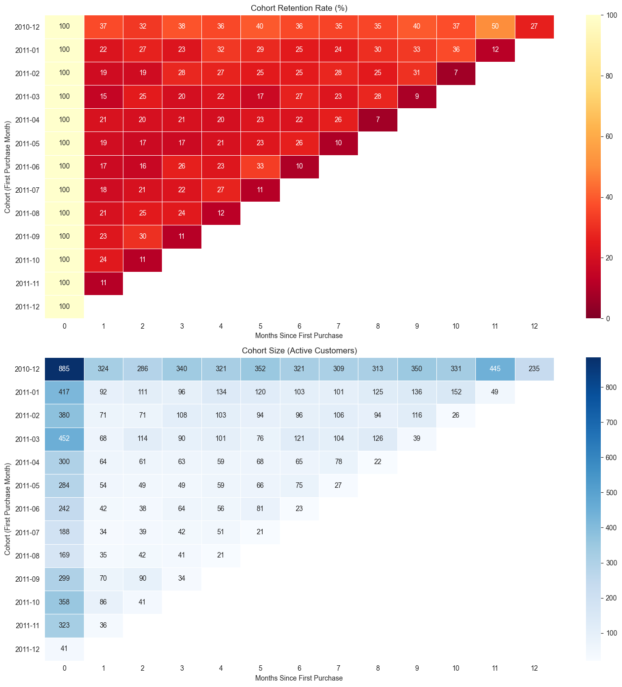

# Predicting Churn and Segmenting Customers in a UK Retail Dataset

## Summary

End-to-end customer analytics on transactions — churn prediction (0.73 AUC), RFM segmentation, market basket analysis, and cohort retention. Built to answer one question: not just who's leaving, but who's worth saving

## Problem

I had 540K transaction records from a UK online retailer and one question: which customers are leaving, and what can we do about it? Churn prediction tells you who might leave. It does not tell you who is worth saving or what to sell them next. So I built an analysis covering churn prediction, customer segmentation, market basket analysis, and cohort retention.

## Approach

About 25% of rows had no CustomerID, 9,288 were cancellations (costing ~£897K), and the UK accounted for 91.5% of transactions. After cleaning, I worked with ~397K transactions across 4,338 customers.

Cleaned 540K rows → defined churn (90-day window) → engineered 11 features → compared 3 models → tuned threshold for recall
Scored RFM manually + KMeans to cross-validate segment labels
Apriori on 11K invoices for association rules
Cohort analysis across 13 months

## Key Results

**Churn: 0.728 ROC AUC.** Logistic Regression beat Random Forest and Gradient Boosting on churn F1 (0.674 vs 0.65 vs 0.64). Lowering the threshold from 0.50 to 0.40 pushed churn recall to 80% while keeping precision at 60%. The margin was small, likely because the feature set was already well-engineered and the dataset too small for tree models to find additional signal.





**13 VIP customers averaged £127K in spend.** KMeans found 4 natural clusters: 13 whales (£127K avg), 211 high value (£12K), 3,052 mid tier (£1,350), and 1,062 dormant (£478).



**Top product pair: lift of 4.86.** Jumbo Bag Strawberry and Jumbo Bag Red Retrospot appear together nearly 5x more than chance. 44 frequent itemsets, 12 rules with meaningful lift.

**Month 1 retention: 20.6%.** Climbed to 31% by month 11. Customers who survive the first purchase get stickier, but losing 80% after order one is the real problem.



## Business Recommendations

1. **Deploy churn alerts at the 0.40 threshold.** At 80% recall, the model catches 4 out of 5 churners. A false positive only costs a retention email.
2. **Protect the 13 VIP customers individually.** They represent outsized revenue concentration. Assign dedicated account management or custom pricing.
3. **Bundle the top Apriori pairs in promotions.** Products with lift above 4 are natural cross sells. Feature them together on landing pages and in cart suggestions.
4. **Focus retention spend on month 1.** Only 20.6% of customers come back after their first order. A targeted email or discount at week 3 could move that number.

## Tech Stack

Python, pandas, NumPy, scikit learn, matplotlib, seaborn, plotly, mlxtend (Apriori), Jupyter

## How to Run

```bash
pip install -r requirements.txt
jupyter notebook ecommerce_customer_analytics.ipynb
```

Run cells top to bottom. Everything (cleaning, feature engineering, modeling, visualization) runs inline from `data/uncleaned_data.csv`. The notebook file is `ecommerce_customer_analytics.ipynb`.

## Data Note

Based on the UCI Online Retail dataset (~542K transactions, Dec 2010 to Dec 2011, UK retailer). Data files are not included in this repository.
